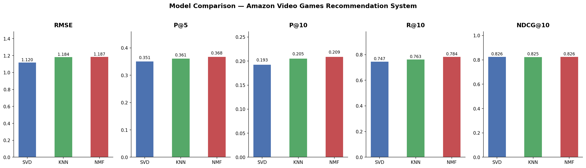

<div align="center">

# 🎮 Amazon Video Games Recommendation System

### Comparing SVD · KNN · NMF with Explainable AI Recommendations

[](https://python.org)
[](https://streamlit.io)
[](https://surpriselib.com)
[](LICENSE)

**[🔴 Live Demo](https://your-app.streamlit.app)** &nbsp;|&nbsp; **[📓 EDA Notebook](notebooks/eda.ipynb)** &nbsp;|&nbsp; **[📊 Model Comparison](outputs/model_comparison.png)**

</div>

---

## 📌 Overview

Most recommendation tutorials stop at "here are your top 10 items." This project goes further — it **compares three algorithms on real Amazon data** and generates **human-readable explanations** for every recommendation, similar to how Amazon shows *"Customers who bought X also bought Y."*

**Key differentiators:**
- ✅ Three algorithms compared on four metrics (not just RMSE)
- ✅ Explainable recommendations with traceable reasoning
- ✅ Temporal train/test split — no data leakage
- ✅ Cold-start fallback for new users
- ✅ Deployed Streamlit web app anyone can use

---

## 📊 Results

| Model | RMSE ↓ | Precision@5 ↑ | Precision@10 ↑ | Recall@10 ↑ | NDCG@10 ↑ |
|:------|:------:|:-------------:|:--------------:|:-----------:|:---------:|
| SVD   | **1.1199** | 0.3511 | 0.1928 | 0.7465 | 0.8256 |
| KNN   | 1.1838 | 0.3613 | 0.2054 | 0.7632 | 0.8251 |
| **NMF** | 1.1872 | **0.3679** | **0.2091** | **0.7837** | **0.8260** |

**Winner:** NMF leads on Precision, Recall, and NDCG@10. SVD leads on RMSE.

> **Why we don't rely on RMSE alone:** RMSE measures how accurately we predict the star rating, but a good recommender needs to rank the *right* items at the *top* — which NDCG measures. A model can have low RMSE but terrible ranking. That's why we use 4 metrics.



---

## 🗂️ Dataset

| Attribute | Value |
|-----------|-------|
| Source | [Amazon Reviews 2023](https://amazon-reviews-2023.github.io/) — Video Games |
| Raw reviews sampled | 1,000,000 (streamed from 2.8M total — no full download) |
| After filtering | **22,841** interactions |
| Users | **2,966** |
| Items | **240** |
| Sparsity | **96.79%** |
| Avg ratings / user | 7.7 |
| Avg ratings / item | 95.2 |
| Split strategy | **Temporal** (80% train / 10% val / 10% test) |

**Filtering strategy:** Users with fewer than 5 ratings and items with fewer than 50 ratings are removed. This is done iteratively until convergence (took 22 iterations) to handle the cascading effect — removing items can drop users below threshold and vice versa.

**Why temporal split?** Randomly splitting would let the model train on 2022 data and "predict" 2020 ratings — that's time travel. Sorting by timestamp and splitting chronologically ensures we always predict future events from past history.

---

## 🧠 How Each Algorithm Works

### SVD — Singular Value Decomposition
The user-item rating matrix (2,966 × 240) is decomposed into three smaller matrices representing **hidden taste profiles** — latent factors like *"prefers RPGs"* or *"budget-conscious buyer"* that the model discovers on its own without being told. We use 100 latent factors trained over 20 epochs.

```
Rating Matrix (2966 × 240) ≈ User Matrix × Σ × Item Matrix
                                 2966×100    100×100  100×240
```

### KNN — Item-Based Collaborative Filtering
For a given item, KNN finds its 40 most similar items using **cosine similarity** on the rating vectors. We use item-based (not user-based) because item relationships are more stable — *"Dark Souls is always similar to Elden Ring"* regardless of when you ask, whereas user tastes drift over time.

### NMF — Non-Negative Matrix Factorization  
Like SVD, but with one constraint: **all factor values must be ≥ 0**. This makes factors loosely interpretable as topics like *"action games"* or *"indie puzzle"* — you can think of each item as a blend of positive strengths rather than a mix of positive and negative abstract values. We use 50 factors over 50 epochs.

---

## 💡 Explainable Recommendations

Most recommenders are black boxes. This project generates **traceable human-readable reasons** for every recommendation.

### KNN — True Explanation (white box)
```
Recommended: Elden Ring — Standard Edition
⭐ Predicted rating: 4.8

Why recommended:
"Users who liked Dark Souls III and Sekiro: Shadows Die Twice
 also highly rated products like this."
```
**How it works:** When KNN recommends Item X, it's because Item X is similar to items the user already rated highly. We trace which of the user's liked items are neighbours of the recommended item — those are the exact reason.

### SVD / NMF — Approximate Explanation
SVD's latent factors are not human-readable (what does "factor 42 = 0.37" mean?). Instead, we use a **co-purchase approximation**:
1. Find other users who also highly rated the recommended item
2. Find what else those users commonly rated highly
3. Use those as the stated reason

```
Recommended: PlayStation 4 DualShock Controller
⭐ Predicted rating: 4.6

Why recommended:
"Users who enjoyed God of War and Spider-Man PS4
 also rated this highly."
```

---

## 📐 Evaluation Metrics — Explained Simply

| Metric | Plain English | Formula |
|--------|--------------|---------|
| **RMSE** | How wrong is our predicted star rating on average? | √(mean(predicted − actual)²) |
| **Precision@K** | Of our top K recommendations, what fraction did the user actually like? | relevant ∩ recommended@K / K |
| **Recall@K** | Of all items the user liked, what fraction did we catch in our top K? | relevant ∩ recommended@K / total relevant |
| **NDCG@K** | Did we put the best items first? Rank 1 matters more than rank 10. | DCG@K / ideal DCG@K |

*"Liked" is defined as rating ≥ 4.0 stars. This threshold separates genuinely positive ratings (4–5★) from neutral/negative ones (1–3★).*

---

## 🏗️ Architecture

```
data/raw/                          ← Original streamed data (gitignored)
    video_games_reviews.csv
    video_games_meta.csv
         │
         ▼
src/preprocess.py                  ← Filter → Encode → Temporal Split
         │
    data/processed/
         ├── train.csv             ← 80% (by time)
         ├── val.csv               ← 10%
         └── test.csv              ← 10%
         │
         ▼
src/train.py                       ← Trains SVD, KNN, NMF via Surprise
         │
    models/
         ├── svd.pkl
         ├── knn.pkl
         └── nmf.pkl
         │
         ├──► src/evaluate.py      ← RMSE, P@K, R@K, NDCG@K + chart
         │
         └──► src/explain.py       ← Neighbour tracing + co-purchase logic
                    │
                    ▼
              src/recommend.py     ← Unified recommendation function
                    │
                    ▼
           app/streamlit_app.py    ← Web application
```

---

## 📁 Project Structure

```
recsys/
├── data/
│   ├── raw/                   ← Downloaded data (gitignored — re-run preprocess.py)
│   └── processed/             ← Cleaned CSVs + encoder mappings
├── notebooks/
│   └── eda.ipynb              ← 5 exploratory analysis plots
├── src/
│   ├── preprocess.py          ← Stream, filter, encode, split
│   ├── train.py               ← Train SVD, KNN, NMF
│   ├── evaluate.py            ← RMSE · Precision@K · Recall@K · NDCG@K
│   ├── explain.py             ← Explainability logic (KNN trace + SVD approximation)
│   └── recommend.py           ← Unified recommendation function with cold-start
├── app/
│   └── streamlit_app.py       ← Web application
├── models/                    ← Saved trained models (.pkl)
├── outputs/
│   └── model_comparison.png   ← Side-by-side metric chart
├── requirements.txt
└── README.md
```

---

## 🛠️ Tech Stack

| Tool | Version | Purpose |
|------|---------|---------|
| Python | 3.12 | Core language |
| [scikit-surprise](https://surpriselib.com) | 1.1.5 | SVD, KNN, NMF algorithms |
| pandas | 3.x | Data manipulation |
| scikit-learn | 1.6 | LabelEncoder, utilities |
| matplotlib / seaborn | latest | EDA + metric plots |
| [Streamlit](https://streamlit.io) | 1.58 | Web application |
| [Hugging Face datasets](https://huggingface.co/datasets/McAuley-Lab/Amazon-Reviews-2023) | 2.19 | Streaming dataset download |
| numpy | 1.26 | Numerical operations |

---


## 🚀 Run Locally

```bash
# 1. Clone
git clone https://github.com/tisha-varma/Amazon-Recommendation-System.git
cd Amazon-Recommendation-System/recsys

# 2. Install dependencies
pip install -r requirements.txt

# 3. Stream & preprocess data   (~5 min — streams 1M records, no full download)
python src/preprocess.py

# 4. Train all 3 models          (~1 min)
python src/train.py

# 5. Evaluate & compare
python src/evaluate.py

# 6. Launch web app
streamlit run app/streamlit_app.py
```

The processed CSVs and trained models are already committed to this repo, so **you can skip steps 3–5 and go straight to step 6.**

---

## 📈 Key EDA Findings

1. **Rating bias:** 64% of all reviews are 5-star — the dataset is heavily skewed toward positive ratings, which inflates RMSE for all models and makes it an unreliable sole metric
2. **Power law distribution:** The top 10% of items receive 60%+ of all ratings — a classic long-tail distribution
3. **High sparsity:** Only 3.21% of the user-item matrix is filled — this is why matrix factorization is needed; we're estimating ~700K missing values from 22K known ones
4. **Temporal growth:** Review volume peaks between 2018–2020; average ratings show a slight downward drift over time, suggesting reviewers became more critical as the platform matured
5. **Cold start reality:** Before filtering, 65% of items had fewer than 5 ratings — these items cannot be meaningfully recommended using collaborative filtering alone

---

## 🔁 How to Interpret the Results

**Why NMF beats SVD on ranking metrics despite worse RMSE:**
NMF's non-negativity constraint acts as an implicit regulariser. All factors represent additive strengths (like topics), making the model less likely to overfit on noisy ratings. This produces better-*ranked* recommendations even if individual rating predictions are slightly less precise.

**Why KNN has the best precision but not the best NDCG:**
KNN finds many relevant items in the top 10 (good precision), but it doesn't always put the *most relevant* item at rank #1 (lower NDCG). SVD and NMF are better at ordering — they produce a finer-grained rating score that separates a 5-star recommendation from a 4.2-star one.

---
